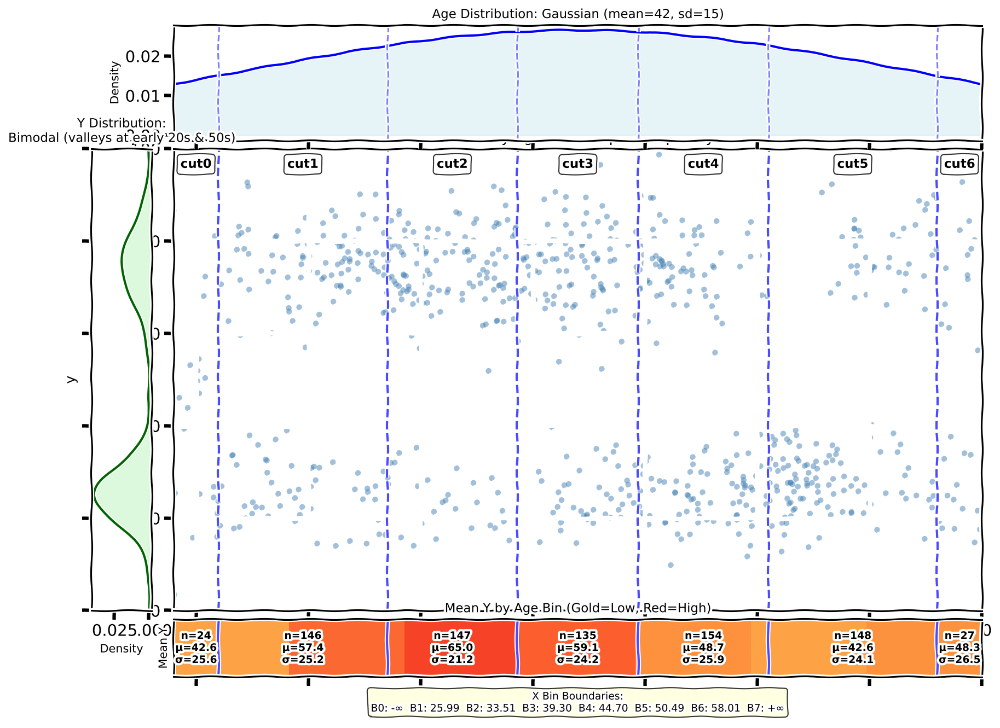

 
          
[&copy; 2026](/LICENSE.md) by [timm](http://timm.fyi)    
          
[](https://github.com/timm/six/blob/main/README.md)
[](https://github.com/timm/six/blob/main/README.md)
[](https://github.com/timm/six/blob/main/README.md)
[](https://timm.github.io/ez/ez.html)
[](https://github.com/timm/ez)
[](https://github.com/timm/ez)
[](https://timm.github.io/ez/docs/)


### ez.py: Explainable Multi-Objective Optimization

**ez.py** is a lightweight, zero-dependency framework for
explicable multi-objective optimization. It was developed as a “straw man”
algorithm for baseline-ing more sophisticated approaches. 
If there is ever 
simple and clever ways to do something, EZ always used the simpler.

The result is 250 lines (plus some test cases) that works remarkable well. 
At the very least, it is a teaching tool or a baseline that can hghlightthe advantage of more sophisticated methods.
At the very most, its a challenge to the research orthodoxy that complex big data methdos are the only and best way to do anything.

## Why ez.py?


> *"In any field, find the strangest thing and explore it."*     
> — John Archibald Wheeler


 This strangest thing about software is that it ever works.   A modest system with 300
boolean variables has 2<sup>300</sup> states—more than the number of
stars in the observable universe (10<sup>24</sup>). If software
required us to manage every one of those states, we would never ship
a single line of code.

Yet, software *does* work. We build the Web, flight controllers,
and banking systems and,  and and.... 

Sure that software sometimes does not work. Software sometimes crashes—perhaps at the most
awkward or dangerous moment. But the fact that it ever works at all, ever, is puzzling.

Maybe the **effective** structure of software is remarkably
simple. The "good" behaviors do not live on needle-point
singularities hidden in a chaotic landscape; they live on broad,
low-dimensional plateaus. A few key variables ("keys") usually
control the entire system.

If the solution space is simpler than the theoretical space:
1. Then we do not need complex optimization frameworks (like genetic
   algorithms or neural nets).
2. We might not need so much "Big Data", al the time
3. And need **Sampling Efficiency** (finding the plateau quickly)
   might be more important than **Computational Efficiency** (processing millions
   of rows).

---

## Case Study: Controlling Flight Software

Does simplicity actually work on real data?

Consider the `xomo_flight` dataset: 10,000 scenarios of flight
software development involving **24 independent variables**
(inputs) and **4 conflicting objectives** (Minimize Effort, Months,
Defects, and Risks).

Running `ez.py` produces the following decision tree:

```text
./ez.py -l 4 --tree ~/gits/moot/optimize/process/xomo_flight.csv

                                     score   N    EFFORT-, MONTHS-...
                                     -----   ---  -------------------
.                                  : 0.5   : 25 : 1119.0, 30.6, ...
FLEx >= 4.428                      : 0.27  :  4 : 786.7, 27.5, ...
FLEx < 4.428                       : 0.55  : 21 : 1182.3, 31.2, ...
| 2.67 <= RUSE < 3.19              : 0.29  :  4 : 819.6, 28.3, ...
| RUSE < 2.67 or RUSE >= 3.19      : 0.61  : 17 : 1267.7, 31.8, ...
| | PCAP >= 4.805                  : 0.36  :  5 : 893.1, 28.1, ...
| | PCAP < 4.805                   : 0.71  : 12 : 1423.7, 33.4, ...
| | | RELY >= 4.82                 : 0.5   :  4 : 1170.8, 31.2, ...
| | | RELY < 4.82                  : 0.79  :  8 : 1550.2, 34.5, ...
{:uses 4 :x 24 :y 4 :rows 10_000 :lo 0.15 :mid 0.48 :win 84}
```


Note what has happened here:

* **Drastic Simplification:** Despite having **24** variables to
choose from, the algorithm found that only **4** mattered
(`FLEx`, `RUSE`, `PCAP`, `RELY`).
* **High Performance:** By controlling just these 4 variables, we
achieve **84%** of the optimal score (`:win 84`).

Hence, do not need to manage 24 complex factors. We only need to manage
the 4 "keys."

----

## Why do I call this "X" for explanation

Internally, ez is a regression tree learner where the goal is a aggregation of multiple
goals. The trees are built from tiny samples of the date (just a few dozen rows) so the resting
trees are always very small.

Traditionally, decision trees for single goals may not be a good explanation tool since they can
grow incomprehensibly large. But I've found that for multi-goal reasoning, when learned
on a few dozens examples, the resulting tree is effective for sorting hold-out data good to bad
(so all you need to do is look at ,say, the five top items in that sort).

And when we compare that approach to other methods (LIME, SHAP, etc) we do much better since
other EZ tools tells you attributes are important while my EZ tells you what ranges are important (i.e.
my tools tell you that X is important _up to this point_). This means you can glance at my small trees
and make policy decisions about (e.g.) how much to change something.
Unlike black-box models (Neural Nets) or feature-weight heuristics (SHAP/LIME), a tiny tree satisfies the complete **Audit of Causal Explanations** by mapping user questions directly to graph traversals.

```text
       [Root]
      /      \
[Bad Branch]  [Good Branch]
(μ=0.79, σ=0.3)  (μ=0.27, σ=0.05)
    ^
    |
 You are here

```

| User Question | The Tree's Answer (Automated) |
| --- | --- |
| **1. How does it work?** | **Global View:** Visualizes the full risk/reward landscape (μ vs σ). |
| **2. How do I use it?** | **Prediction:** Maps input row *R* to the matching leaf (μ). |
| **3. What did it just do?** | **Trace:** Prints the specific logic path (e.g., `x < 5` AND `y > 10`). |
| **4. What does it achieve?** | **Context:** Ranks the current result against the best/worst possible branches. |
| **5. What to do next?** | **Recourse:** Finds the nearest better branch minimizing edit distance ( |
| **6. How much effort?** | **Cost:** Quantifies the specific feature changes required for the recourse. |
| **7. What will it do next?** | **Sensitivity:** Predicts outcome if input drifts by Δ. |
| **8. Why didn't it do Z?** | **Contrast:** Identifies the specific rule violation preventing outcome *Z*. |
| **9. How do I avoid failure?** | **Safety:** Identifies the "cliff edge" boundary to the worst branch (High σ). |

*Based on Pearl's Ladder of Causation and Gigerenzer's Fast & Frugal Heuristics.*

## Under the Hood, How Does EZ  Work?

In EZ, if we have (say) three goals 

    debt, happiness, weath

that we want to minimize, maximize and maximize, then "heaven" for those goals is

    0,1,1

For each row of data, we can look at the _y_ values, normalizing them 0..1 then score them by their
distance to heaven. E.g. if i have average debt (.5), high happiness (.75) and high wealth (.8)
then that the distance to heaven is

    sqrt(squred(.5-0) + squared(.75 - 1) + squared(.8 - 1)) / sqrt(3)
    = sqrt(.25 + 0.0625 + 0.04)
    = 0.34

Note that _smaller_ distance are _better_ since that means we are getting closer to heaven.

All the _x_ inputs are  divided into (say) 7 cuts and we log what "heavens" are seen in each cut. 
To divide the x values we track _xmu_ and _xsd_ then cut  _xi_ value
as follows:

    BINS = 7 # for example
    z = (xi - xmu) / xsd
    cut = int(BINS / (1+exp(-1.7 * z)) # cut is one of 0,1,2,..., BINS-1

(Aside:  if you are interested, this little bit of maths creates
equal-population bins without needing to sort the data or calculate
complex integrals.  It uses an approximate  Logistic Sigmoid to
estimate the normal cumulative distribution function.)

Now that we have the cuts, we add in what "distance to heaven"
values are seen in each cut. For example, here we have split "age"
into seven cuts. The summary table (in Orange) shows where  the
_y_ values fell.



EZ picks the cut with lowest _y_ scores.
If there is a tie, the _sd_ tells us which one to use.
For example, in this data,
we could decide to cut _age_ on _cut4_ sine since he _mu=42.6_
value in cut4 since that tells us that  this cut is closet to heaven. Note that _cut4_ ties with _cut0_
but we ignore _cut0_ since the uncertainty there is higher.

After that, tree generation is just recursive cutting. At each level of the tree, the
roes are split on the best cut.
EZ then recurses into each split.

```python
def treeGrow(data, rows, cut=None):
  tree = Tree(rows,cut)
  if len(rows) > the.leaf*2: # stop when too few rows
    if cut1 := findBestCut(data,rows):
      ok,no = [],[]
      for row in rows: (ok if cutSelects(cut1,row) else no).append(row)
      if ok and no:
        tree.kids[True]  = treeGrow(data, ok, cut1)
        tree.kids[False] = treeGrow(data, no, cut1)
  return tree
```

---

## FAQ: Philosophy & Design

### 1. The "Backpacking" Philosophy (Why no Pandas/Numpy?)

**Q: Why implement custom `Num`/`Sym` classes and CSV parsers

**A:** We practice **"Backpacking"** software design—carrying only
what is strictly necessary. By removing heavy external dependencies,
this code achieves:

* **Auditability:** Every line of logic is visible and understandable
by a human.
* **Portability:** It runs in restricted environments, CI/CD
pipelines, or secure air-gapped systems where `pip install` is
blocked.
* **Supply Chain Security:** It is immune to attacks on upstream
libraries.
* **Longevity:** It will run 10 years from now without "dependency
hell."

### 2. Novelty & "Complexity Theater"

**Q: Isn't "Keep It Simple" (KISS) obvious? What is novel here?**

**A:** KISS is a slogan, not a practice. The industry currently
suffers from **Complexity Theater**.
In a recent survey of 229 papers applying LLMs to Software
Engineering, **only 5%** compared their complex results against a
simple baseline. This work provides rigorous proof that simple
methods are not just "okay"—they are often optimal because they
exploit the underlying simplicity of the software domain.

### 3. Random Probing vs. "Smart" Search

**Q: Why does the code rely on random probing? Isn't that just
"dumb luck"?**

**A:** It is not luck; it is geometry.
If the "success zone" of a software configuration were a tiny point,
random probing would fail. But because the success zone is usually
a large manifold (a plateau), random probing hits it with
surprising frequency. We aren't "monkeys typing Shakespeare"; we
are monkeys throwing darts at a barn door. It is hard to miss.

### 4. Simplicity & Discretization (Why `bins=7`?)

**Q: Why is `bins=7` hard-coded? Why not use dynamic binning?**

**A:** Because complexity is a cost we refuse to pay without proof.
Cognitive science (Adams, Fillon) proves humans have a 4:1 bias
toward **adding complexity** rather than removing it. We
instinctively think "more bins = better." However:

* **Cognitive Load:** `7` aligns with **Miller’s Law** (humans
hold 7 +/- 2 items in working memory). If an explanation
requires 20 bins, it is not "explainable."
* **Statistical Robustness:** With small samples (e.g., N=30),
sqrt(N) approx 5.5. Using 7 bins matches the granularity
justifiable by the data.

### 5. Performance & Scale

**Q: This code iterates using standard Python loops. Won't this
grind to a halt on large datasets?**

**A:** You are confusing **Computational Efficiency** with
**Sampling Efficiency**.
Standard optimizers assume the haystack is hard to search, so they
build massive machinery to sift through it. We assume the "needle"
is actually quite large.
Empirical evidence on 120+ SE datasets shows that evaluating just
**30 to 100 samples** is often sufficient to rank the top
solutions. When N=30, Python loops are instantaneous. We don't
need to process the whole dataset to understand it.

---

## Quick Start

### Installation

This is a single-file script. No `pip install` required.

```bash
# Download source
curl -O \
[https://raw.githubusercontent.com/timm/six/refs/heads/main/src/ez.py](https://raw.githubusercontent.com/timm/six/refs/heads/main/src/ez.py)

mv ez.py ez
chmod +x ez

# Download sample data
mkdir -p $HOME/gits
git clone [http://github.com/timm/moot](http://github.com/timm/moot) $HOME/gits/moot

```

### Usage

Run the script on a CSV file. The columns in the CSV header
determine the objective:

* `Name+`: Maximize this column.
* `Name-`: Minimize this column.
* `Name`: Independent variable.

```bash
# Run with default settings
./ez --tree $HOME/gits/moot/optimize/misc/auto93.csv

# Custom settings: 
#   -B 50 (Budget of 50 evaluations)
#   -b 5  (Discretize into 5 bins)
./ez -B 50 -b 5 -d $HOME/gits/moot/optimize/misc/auto93.csv

```

### Command Line Options

```text
  -h                help
  -b bins=7         set number of bins for discretization
  -B Budget=30      set number of rows to evaluate
  -C Check=5        set number of guesses to check
  -d data=data.csv  set data to load
  -l leaf=2         set examples per leaves in a tree
  -s seed=1         set random number seed

```

---

*(c) 2026 Tim Menzies, MIT License*


